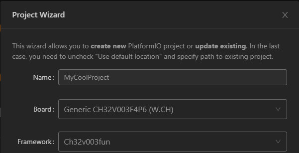

# ch32v003fun

An open source development environment (tooling, headers, examples) for the [CH32V003](http://www.wch-ic.com/products/CH32V003.html) (and many other chips within the CH32V family) with gcc-riscv64 that can be used in Windows (Native), Linux and/or WSL.  The CH32V003 is 10-cent part with a RISC-V EC core that runs at 48MHz, has 16kB of flash and 2kB of RAM and a bunch of peripherals.  It also comes in SOP-8, QFN-20 and SOIC packages.  You can get the datasheet [here](http://www.wch-ic.com/downloads/CH32V003DS0_PDF.html).

The goal of this project is to develop the tooling and environment for efficient use of the CH32V003.  Avoid complicated HALs, and unleash the hardware! The existing EVT is massive, and dev environment weighty.  This project specifically avoids the HAL and makes it so you can just use the [TRM](http://www.wch-ic.com/downloads/CH32V003RM_PDF.html). In contrast, blinky is only 500 bytes with ch32v003fun, boots faster, and significantly simpler overall.

ch32v003fun contains:
1. Examples using ch32v003fun, but not as many as using the HAL.
2. "minichlink" which uses the WCH CH-Link with libusb, for cross-platform use.
  * An STM32F042 Programmer, the [NHC-Link042](https://github.com/NgoHungCuong/NHC-Link042)
  * An ESP32S2 Programmer, the [esp32s2-funprog](https://github.com/cnlohr/esp32s2-cookbook/tree/master/ch32v003programmer)
  * The official WCH Link-E Programmer.
  * An Arduino-based interface, [Ardulink](https://gitlab.com/BlueSyncLine/arduino-ch32v003-swio).
  * Supports gdbserver-style-debugging for use with Visual Studio.
  * Supports printf-over-single-wire. (At about 400kBaud)
3. An extra copy of libgcc so you can use unusual risc-v build chains, located in the `misc/libgcc.a`.
4. A folder named "ch32v003fun" containing a single self-contained source file and header file for compling apps for the ch32v003.
5. On some systems ability to "printf" back through
6. A demo bootloader.

## Other family support

Currently, there is experimental support for the ch32v103, ch32v203, ch32v208, ch32v303, ch32v305 and ch32v307.  GDB is mostly tested on the 003, but works, to a limited degree on the other processors.

## Getting Started

For installation / setup instructions, see the [wiki page here](https://github.com/cnlohr/ch32v003fun/wiki/Installation)

## Features!

###  A fast "printf" debug over the programming interface.

And by fast I mean very fast. Typically around 36kBytes/sec.

```
./minichlink -T | pv > /dev/null
Found ESP32S2 Programmer
 536KiB 0:00:15 [36.7KiB/s] [        <=>                     ]
```

You can just try out the debugprintf project, or call SetupDebugPrintf(); and printf() away.

### Debugging support!

Via gdbserver built into minichlink!  It works with `gdb-multiarch` as well as in Visual Studio Code 

## Building and Flashing

```
cd examples/blink
make
```

text = code, data = constants and initialization values, bss = uninitialized values.  
dec is the sum of the 3 and reflects the number of bytes in flash that will get taken up by the program.

The generated .bin is used by minichlink and the .hex file is compatible with the official WCH flash tool.  

## VSCode +/- PlatformIO

Note: PlatformIO is generally used for CI on this repo. While PlatformIO can be used to code and debug a ch32v003fun project inside VSCode, you can also do it completely without PlatformIO: For that, see [template project](https://github.com/cnlohr/ch32v003fun/tree/master/examples/template/.vscode).

This project can be built, uploaded and debugged with VSCode and the PlatformIO extension. Simply clone and open this project in VSCode and have the PlatformIO extension installed. Use the [project environment switcher](https://docs.platformio.org/en/latest/integration/ide/vscode.html#project-tasks) to select a specific example, such as "blink".

To create a new PlatformIO firmware project based on ch32v003fun, simply use the [PlatformIO Home](https://docs.platformio.org/en/latest/home/index.html)'s "New Project" wizard and set "Framework" to "ch32v003fun". There are [various examples](https://github.com/Community-PIO-CH32V/platform-ch32v/tree/develop/examples/blinky-ch32v003fun).



The equivalent [PlatformIO Core CLI](https://docs.platformio.org/en/latest/integration/ide/vscode.html#platformio-core-cli) command would be
```sh
pio init -b genericCH32V003F4P6 -O "framework = ch32v003fun"
```

If you want to add your code directly to ch32v003fun project, please expand the available environments in the `platformio.ini` as [per instructions](https://github.com/cnlohr/ch32v003fun/blob/49640fbccf231191aa83c6a2bbe9d385535b2d1e/platformio.ini#L48-L53).

Please also note that when you open this project inside PlatformIO, you can use the [project environment switcher](https://docs.platformio.org/en/latest/integration/ide/vscode.html#project-tasks) at the bottom of the VSCode taskbar to select a specific example folder. Otherwise, "Build" will by default build **all** examples.

See [platform-ch32v](https://github.com/Community-PIO-CH32V/platform-ch32v) for further details and installation of the platform.

## clangd

If the C/C++ language server clangd is unable to find `ch32v003fun.h`, the example will have to be wiped `make clean` and built once with `bear -- make build`, which will generate a `compile_commands.json`, which clangd uses to find the include paths specified in the makefiles.  
`make clangd` does this in one step.
`build_all_clangd.sh` does in `build scripts` does this for all examples.

## Quick Reference
 * **REQUIRED** for programming/debugging: `SWIO` is on `PD1`. Do not re-use PD1 for multiple functions.
 * **OPTIONAL** `NRST` is on `PD7`. Not needed, defaults as GPIO in some configurations.
 * **OPTIONAL** UART `TX` is on: `PD5`. We recommend using SWIO for `printf` debugging.


## More examples / projects?

Other third party tools are adding lots of examples, etc.  See the following repos, for extra libraries, etc.
 * [ch32v003fun_wildwest](https://github.com/recallmenot/ch32v003fun_wildwest)
 * [ch32v003fun_libs](https://github.com/hexeguitar/ch32v003fun_libs)
 * [CH32V003_lib_uart](https://github.com/ADBeta/CH32V003_lib_uart)
 * [CH32Vxxx_lib_i2c](https://github.com/ADBeta/CH32Vxxx_lib_i2c)
 * [CH32Vxxx_lib_swi2c](https://github.com/ADBeta/CH32Vxxx_lib_swi2c)
 * [ch32v003fun_shenanigans](https://github.com/DeadBugEngineering/ch32v003fun_shenanigans)

## Support

You can open a github ticket or join my Discord in the #ch32v003fun channel.  Right now invites are private, so just ping me @cnlohr for an invite link.  My PMs are open.

### Footnotes/links

 * https://raw.githubusercontent.com/openwch/ch32v003/main/RISC-V%20QingKeV2%20Microprocessor%20Debug%20Manual.pdf Debugging Manual
 * http://www.wch-ic.com/downloads/QingKeV2_Processor_Manual_PDF.html Processor Manual
 * http://www.wch-ic.com/downloads/CH32V003RM_PDF.html Technical Reference Manual
 * http://www.wch-ic.com/downloads/CH32V003DS0_PDF.html Datasheet
 * https://github.com/CaiB/CH32V003-Architecture-Exploration/blob/main/InstructionTypes.md Details for the compressed ISA on this chip.
 * The CH32V003 has xv extensions, you can use this customized version of rvcodec.js to work with its opcodes: https://xw.macyler.moe/
