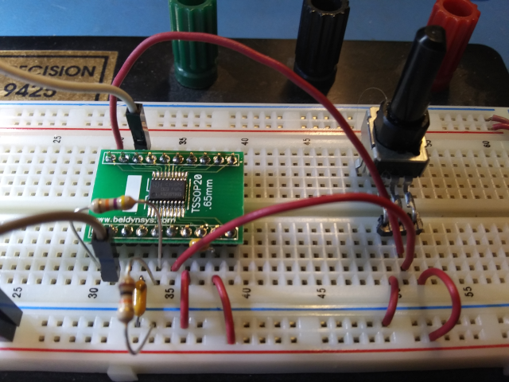

# DMA ADC & op-amp example
This example code demonstrates the use of the CH32V003 on-chip ADC in continuous
DMA mode wherein several analog input channels are configured on GPIO and then
automatically digitized into a memory buffer. When software needs a channel
reading it need only access the buffer to get the latest result.

Additionally, the on-chip op-amp is enabled on one of the input channels to
allow some gain.

## Theory
This demo will sample four channels, one of which is connected to the internal
op-amp. Sampling will happen continuously with no processor intervention and
results saved in a fixed-length buffer that is constantly overwritten with
new data. When the op-amp is enabled and properly wired up then its output can
be evaluated with respect to other analog signals input to the ADC.

### ADC
The ADC can sample from eight GPIO pins and two internal references. In this
example we use four channels on GPIO pins. Continuous conversion is used with
DMA enabled. The following channels are used
* Pin PD4, A7 - op-amp output
* Pin PD3, A4
* Pin PD2, A3
* Pin PC4, A2

### DMA
DMA channel 1 is dedicated to the ADC and is set up for half-words from peripheral
to memory, circular. The buffer length is identical to the number of channels that
are being used so reading from offset N in the buffer is equivalent to reading
channel sequence #N results.

### Op-Amp
The op-amp is internally connected with its output on pin PD4, positive input on
either pin PD7 or PA2 and negative input on PD0 or PA1. PA1, PA2 and PD7 are
already in use for the crystal and NRST on the WCH eval board so it's difficult
to test the op-amp in that system.
* Using PA1 and PA2 requires removing the crystal and loading caps, as well as
installing zero-ohm resistors.
* Using PD7 as an op-amp input requires disabling the NRST function which must
be done by accessing the user option byte in flash memory.

For this case I went off of the WCH EVT board and lashed up a "raw" CH32V003
on a breadboard using the PA1 and PA2 pins.

## Use
To test ADC DMA only, flash the code to a device and connect a serial terminal
to pin PD5. Observe four columns of data printed for the ADC results on
PD4, PD3, PD2 and C4. With nothing connected they will float around 1.6V and
yield results near 500. Grounding any of those pins will force the result to 0
while tying the pin to VDD will force it to 1023.

Testing the op-amp, connect as in the schematic above and observe that the first
column shows a value that's 5.7x greater than the second column.
