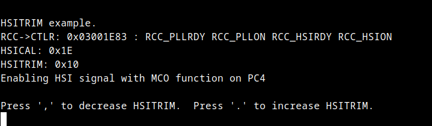
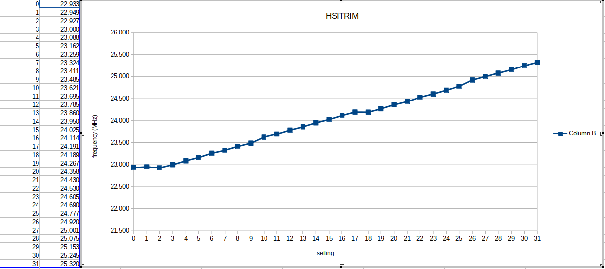

This example demonstrates the HSITRIM feature of the High Speed Internal clock.  Upon startup, the HSICAL value
is loaded into the RCC_CTLR register and HSICAL is loaded with the value 16 (0b10000).  This example uses the MCO
feature to route the HSI clock signal to an external pin (PC4) and to allow the HSITRIM value to be varied by
interactive commands over the serial port.

