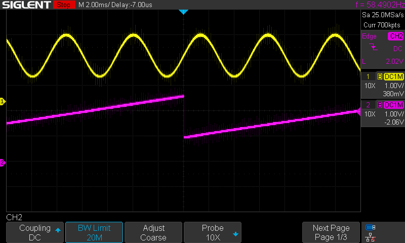
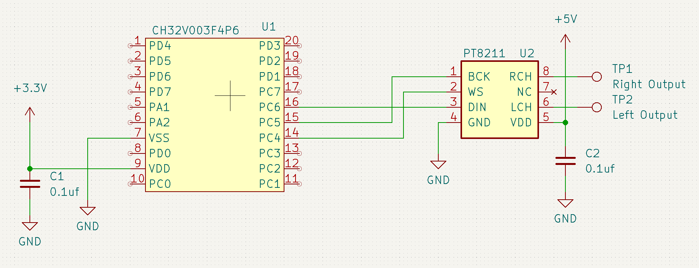

# SPI DAC Demo
This example shows how to set up the SPI port with a timer, circular DMA and
IRQs to do continuous audio output through an inexpensive I2S DAC.

 

## Theory
The CH32V003 does not have an I2S port which is usually required for driving
audio DACs, but the inexpensive PT8211 stereo audio DAC is very forgiving of
the signal format used to drive it so we can approximate an I2S signal using
one of the CH32V003 on-chip timers to generate the frame sync signal. The SPI
port then provides the bit clock and serial data.

### Timer setup
TIM1 on the CH32V003 is set up to generate a 48kHz square wave which is output
on GPIO pin PC4 and serves as the frame sync or WS. The timer is configured to
run in center-aligned mode 3 which generates DMA requests on both rising and
falling edges. Channel 4 is configured as the output and the threshold is set
to 50% and the overall period is set to 48kHz.

### SPI setup
SPI1 is configured for 16-bit TX with a bit clock of 48MHz/8 (3MHz) which is
fast enough to clock out 16 bits of data between the edges of the frame sync
signal. Transmit data arrives via DMA, but the SPI port does not control DMA -
that is triggered from the timer above.

### DMA setup
DMA1 channel 4 is used because that channel is connected to TIM1 Chl 4 output
and is set up in circular mode with both Half-transfer and Transfer-Complete
interrupts. It continuously pulls data out of a 32-word buffer and sends it to
the SPI port when the timer fires.

### Interrupts
The DMA TC and HT IRQs trigger execution of a buffer fill routine which simply
indexes through a sinewave table at variable rates using fixed-point math to
fill the buffer as requested. This process uses up only about 4% of the
available CPU cycles so there's plenty leftover for foreground processing or
more complex waveform calculations like interpolation or synthesis.

## Use
Connect a PT8211 DAC as follows:
* DAC pin 1 (BCK) - MCU pin 15 (PC5/SCK)
* DAC pin 2 (WS)  - MCU pin 14 (PC4/T1CH4)
* DAC pin 3 (DIN) - MCU pin 16 {PC6/MOSI)
* DAC pin 4 (GND) - ground
* DAC pin 5 (VCC) - 3.3V or 5V supply
* DAC pin 6 (LCH) - left channel output
* DAC pin 8 (RCH) - right channel output

Connect an oscilloscope to the left and right channel outputs and observe a
sine waveform at 187Hz on the right channel output and a sawtooth wave at
47Hz on the left channel output.
