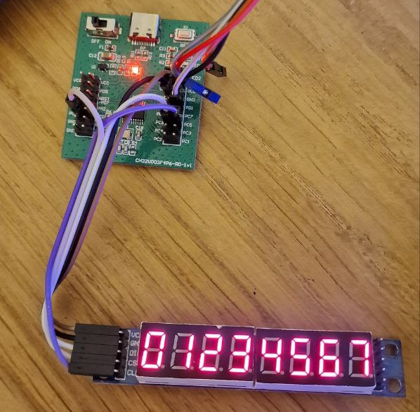

# MAX7219 8 digit 7 segment display demo

This example for the `max7219_spi_driver` and `max7219_spi_driver_extended` library demonstrates controlling a MAX7219 or MAX7221 based display over SPI with basic and advanced text writing, and at least one example of every available display function in some capacity.

---

The MAX7219 and MAX7221 chipsets are used in many 8 character 7 segment and 8x8 single colour dot matrix displays which can be purchased preassembled on eBay and AliExpress very cheaply. The abundance and low cost of these displays makes them a great companion for small projects requiring a display output that is more capable than single LEDs but not as complex as something like an LCD.

---

The example expects you to connect a MAX7219 based 7 segment 8 character display to your CH32V003 like so:
- `DIN` / `MOSI` to `PC6`
- `SCLK` to `PC5`
- `CS` to `PD0`

You can choose which examples will be shown on the display by changing the `spi_max7219.c` file in the marked demo selection section. All examples are enabled by default.

Once running, you'll see one of the many examples being displayed like so:
